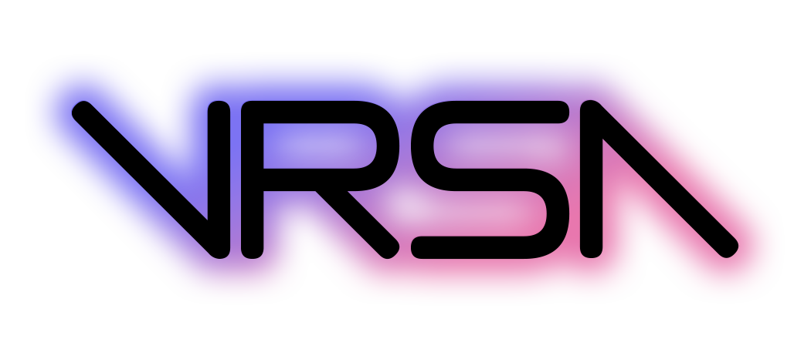

[![Contributors][contributors-shield]][contributors-url]
[![Forks][forks-shield]][forks-url]
[![Stargazers][stars-shield]][stars-url]
[![Issues][issues-shield]][issues-url]
[![MIT License][license-shield]][license-url]

 

  

  <h3 align="center">VRStartAssistant</h3>

  

    An all-in-one app that helps me set up a one-click automated VR setup. 
    <i>This is not meant for others to use out of the box. &mdash; no executables will be provided</i>
     
  

<!-- TABLE OF CONTENTS -->

  
Table of Contents

  <ol>
    <li>
      <a href="#about-the-project">About The Project</a>
      <ul>
        <li><a href="#built-with">Built With</a></li>
      </ul>
    </li>
    <li><a href="#contributing">Contributing</a></li>
    <li><a href="#license">License</a></li>
    <li><a href="#contact">Contact</a></li>
    <li><a href="#acknowledgments">Acknowledgments</a></li>
  </ol>

<!-- ABOUT THE PROJECT -->
## About The Project

An all-in-one app that helps me set up a one-click automated VR setup. It starts [VRCX](https://github.com/vrcx-team/VRCX), [SteamVR](https://store.steampowered.com/app/250820/SteamVR/), [AdGoBye](https://github.com/AdGoBye/AdGoBye), [VRChat](https://hello.vrchat.com/), [VRCVideoCacher](https://git.ellyvr.dev/Elly/VRCVideoCacher), [Better Index Finger](https://taka3t.booth.pm/items/5240000), and (a custom/beta version of) [WindowsXSO][WindowsXSOUrl] in a time-based, sequential order.
 
It also automatically turns on some smart plugs used for Base Stations, and turns them off upon SteamVR exit.

### Built With

[![Rider][Rider]][RiderUrl] [![DotNet][CSharp]][DotNetUrl] [![Sublime Text][Sublime]][SublimeUrl] 
[![AudioSwitcher][AudioSwitcher]][AudioSwitcherUrl] 

<!-- CONTRIBUTING -->
## Contributing

Contributions are what make the open source community such an amazing place to learn, inspire, and create. Any contributions you make are **greatly appreciated**.

If you have a suggestion that would make this better, please fork the repo and create a pull request. You can also simply open an issue with the tag "enhancement".
Don't forget to give the project a star! Thanks again!

1. Fork the Project
2. Create your Feature Branch (`git checkout -b feature/AmazingFeature`)
3. Commit your Changes (`git commit -m 'Add some AmazingFeature'`)
4. Push to the Branch (`git push origin feature/AmazingFeature`)
5. Open a Pull Request

<!-- LICENSE -->
## License

Distributed under the MIT License. See [`LICENSE`][license-url] for more information.

<!-- CONTACT -->
## Contact

Lily - [@MintLiIy](https://x.com/MintLiIy) - contact@mintylabs.dev

Project Link: [https://github.com/MintLily/VRStartAssistant](https://github.com/MintLily/VRStartAssistant)

<!-- ACKNOWLEDGMENTS -->
## Acknowledgments

* Othneil Drew - for the [README Style](https://github.com/othneildrew/Best-README-Template)
* Katie - For help with the Windows API (From [WindowsXSO][WindowsXSOUrl])
* [xenolightning](https://github.com/xenolightning) - For Audio Switching (from [AudioSwitcher](https://github.com/xenolightning/AudioSwitcher))
* [Home Assistant](https://www.home-assistant.io/) - For their [RestAPI](https://developers.home-assistant.io/docs/api/rest/) docs
* * [Elly](https://github.com/Ellyvr) ([GitLab](https://git.ellyvr.dev/Elly)) - For sanity checking my first time use of websocket/api things in C# using [RestSharp](https://restsharp.dev/)

(<a href="#readme-top">back to top</a>)

<!-- MARKDOWN LINKS & IMAGES -->
[contributors-shield]: https://img.shields.io/github/contributors/MintLily/VRStartAssistant.svg?style=for-the-badge
[contributors-url]: https://github.com/MintLily/VRStartAssistant/graphs/contributors
[forks-shield]: https://img.shields.io/github/forks/MintLily/VRStartAssistant.svg?style=for-the-badge
[forks-url]: https://github.com/MintLily/VRStartAssistant/network/members
[stars-shield]: https://img.shields.io/github/stars/MintLily/VRStartAssistant.svg?style=for-the-badge
[stars-url]: https://github.com/MintLily/VRStartAssistant/stargazers
[issues-shield]: https://img.shields.io/github/issues/MintLily/VRStartAssistant.svg?style=for-the-badge
[issues-url]: https://github.com/MintLily/VRStartAssistant/issues
[license-shield]: https://img.shields.io/github/license/MintLily/VRStartAssistant.svg?style=for-the-badge
[license-url]: https://github.com/MintLily/VRStartAssistant/blob/main/LICENSE
[releases-url]: https://github.com/MintLily/VRStartAssistant/releases

[Rider]: https://img.shields.io/badge/Rider-000000?style=for-the-badge&logo=rider&logoColor=white
[RiderUrl]: https://jb.gg/OpenSourceSupport
[CSharp]: https://img.shields.io/badge/DotNet%208-512BD4?style=for-the-badge&logo=csharp&logoColor=white
[DotNetUrl]: https://dotnet.microsoft.com/en-us/download/dotnet/8.0
[Sublime]: https://img.shields.io/badge/Sublime%20Text-FF9800?style=for-the-badge&logo=sublimetext&logoColor=white
[SublimeUrl]: https://www.sublimetext.com/

<!-- NuGet Packages -->
[AudioSwitcher]: https://img.shields.io/badge/AudioSwitcher-004880?style=for-the-badge&logo=nuget&logoColor=white
[AudioSwitcherUrl]: https://www.nuget.org/packages/AudioSwitcher.AudioApi.CoreAudio
[RestSharp]: https://img.shields.io/badge/RestSharp-004880?style=for-the-badge&logo=nuget&logoColor=white
[RestSharpUrl]: https://www.nuget.org/packages/RestSharp
[Serilog]: https://img.shields.io/badge/Serilog-004880?style=for-the-badge&logo=nuget&logoColor=white
[SerilogUrl]: https://www.nuget.org/packages/Serilog/
[Serilog.Expressions]: https://img.shields.io/badge/Serilog.Expressions-005a80?style=for-the-badge&logo=nuget&logoColor=white
[Serilog.Sinks.Console]: https://img.shields.io/badge/Serilog.Sinks.Console-005a80?style=for-the-badge&logo=nuget&logoColor=white
[Serilog.Sinks.File]: https://img.shields.io/badge/Serilog.Sinks.File-005a80?style=for-the-badge&logo=nuget&logoColor=white
[XSNotifications]: https://img.shields.io/badge/XSNotifications-004880?style=for-the-badge&logo=nuget&logoColor=white
[XSNotificationsUrl]: https://www.nuget.org/packages/XSNotifications

<!-- Other Links -->
[XSOverlaySteam]: https://store.steampowered.com/app/1173510/XSOverlay/
[WindowsXSOUrl]: https://github.com/Minty-Labs/WindowsXSO
